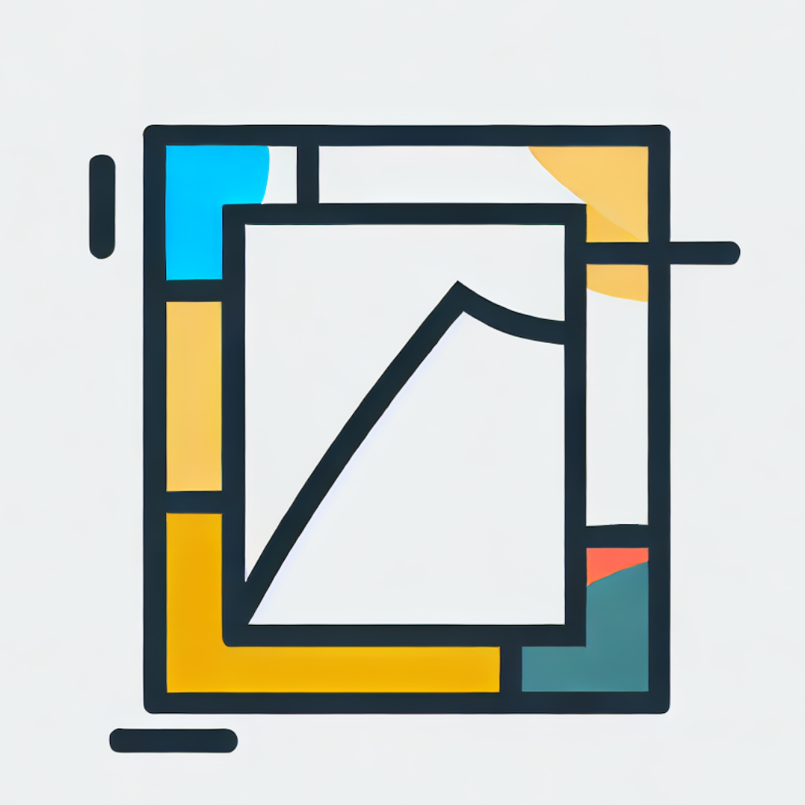

<a name="readme-top"></a>

<!-- PROJECT SHIELDS -->
<!--
*** I'm using markdown "reference style" links for readability.
*** Reference links are enclosed in brackets [ ] instead of parentheses ( ).
*** See the bottom of this document for the declaration of the reference variables
*** for contributors-url, forks-url, etc. This is an optional, concise syntax you may use.
*** https://www.markdownguide.org/basic-syntax/#reference-style-links
-->

<!-- [![Contributors][contributors-shield]][contributors-url]
[![Forks][forks-shield]][forks-url]
[![Stargazers][stars-shield]][stars-url]
[![Issues][issues-shield]][issues-url]
[![MIT License][license-shield]][license-url] -->

<!-- PROJECT LOGO -->
<br />
<div align="center">
  <a href="https://github.com/mirroredfables/mirroredfables">
    
  </a>

<h3 align="center">mirroredfables</h3>

  <p align="center">
    an AI powered visual novel generator
    <br />
    <!-- <a href="https://github.com/mirroredfables/mirroredfables"><strong>Explore the docs »</strong></a> -->
    <!-- <br /> -->
    <!-- <br /> -->
    <a href="https://www.mirroredfables.com">Visit App</a>
    ·
    <a href="https://github.com/mirroredfables/mirroredfables/issues">Report Bug</a>
    ·
    <a href="https://github.com/mirroredfables/mirroredfables/issues">Request Feature</a>
  </p>
</div>

<!-- TABLE OF CONTENTS -->
<details>
  <summary>Table of Contents</summary>
  <ol>
    <li><a href="#about-the-project">About The Project</a></li>
    <li><a href="#getting-started">Getting Started</a></li>
    <li><a href="#roadmap">Roadmap</a></li>
    <li><a href="#contributing">Contributing</a></li>
    <li><a href="#license">License</a></li>
    <li><a href="#contact">Contact</a></li>
    <li><a href="#acknowledgments">Acknowledgments</a></li>
  </ol>
</details>

<!-- ABOUT THE PROJECT -->

# About The Project

<!-- [![Product Name Screen Shot][product-screenshot]](https://example.com) -->

[mirroredfables](https://www.mirroredfables.com) is an AI powered visual novel generator, currently in very early developmental stages.

give it an input, and it will create a world with characters, images, and music.

<!-- GETTING STARTED -->

# Getting Started

## Installation - Local

1. Clone the repo
   ```sh
   git clone https://github.com/mirroredfables/mirroredfables.git
   ```
2. Install NPM packages
   ```sh
   npm install
   ```

## Run - Local

1. Running it as an Expo web app
   ```sh
   npx expo start --web
   ```
   You can also run it as an Expo go app.

&nbsp;

Note: there are three functions that are cloudflare server based that are niced to have under `functions/`. (save games to r2, save generated image to cloudflare, search youtube for music).

To run them with wrangler, do the following:

2. (Optional) Rename `.dev.vars.example` to `.dev.vars` and fill in the API keys
3. (Optional) Rename `functions/_middleware.ts.example` to `functions/_middleware.ts`
4. (Optional) Export the project for web
   ```sh
   npx expo export --platform web
   ```
5. (Optional) Run wrangler (default is http://localhost:8788, if you use a different port, do a find and replace in code, then re-export)
   ```sh
   npx wrangler pages dev dist
   ```
   (Optional) or if you want to use buckets for saving games
   ```sh
   npx wrangler pages dev dist --r2=BUCKET
   ```
6. (Optional) Once the app is running, either through expo or wrangler, open the app, then go to `"Desktop" -> "Turn on Debug" -> "Turn on Use Local Server"`

## Deploy - Cloudflare

1. Fork the repo
2. Go to Cloudflare Pages -> Deploy a site from your git account
3. (Optional) Change the hardcoded urls from `https://www.mirroredfables.com` to your domain
4. Use the following build settings:
   | Build command: | npx expo export --platform web |
   | --- | --- |
   | Build output directory: | /dist |
   | Root directory: | / |
   | Environment variables (remember to set both preview and prod): | |
   | CLOUDFLARE_ACCOUNT_ID | YOUR_CLOUDFLARE_ACCOUNT_ID |
   | CLOUDFLARE_API_TOKEN | YOUR_CLOUDFLARE_API_TOKEN |
   | YOUTUBE_API_KEY | YOUR_YOUTUBE_API_KEY |
5. Add a R2 bucket bindings (remember to set both preview and prod)

<!-- ROADMAP -->

# Roadmap

- [ ] Add in support for retrying prompts when OpenAI is busy
- [ ] Add choices to game engine
- [ ] Add support for multiple sprites per character to game engine
- [ ] Add competibility support for renpy scripts (\*maybe)
- [ ] Support other AIs (beside OpenAI)
- [ ] Support other image generators (beside DALL-E)
- [ ] Support other voice generators (beside Eleven)

See the [open issues](https://github.com/mirroredfables/mirroredfables/issues) for a full list of proposed features (and known issues).

Current known bugs:

- [ ] On iOS Safari, autoplay for voice and music doesn't work due to apple limitations.
- [ ] Expo metro has an issue packing assets, on web favicon doesn't show up (font is using a patch fix)
- [ ] Storybook and metro are not currently compatible

<!-- CONTRIBUTING -->

# Contributing

Contributions are **greatly appreciated**.

<!-- LICENSE -->

# License

Distributed under the MIT License. See `LICENSE` for more information.

<!-- CONTACT -->

# Contact

Web: [www.mirroredfables.com](https://www.mirroredfables.com)

Twitter: [@mirroredfables](https://twitter.com/mirroredfables)

Email: [hello@mirroredfables.com](hello@mirroredfables.com)

Source: [https://github.com/mirroredfables/mirroredfables](https://github.com/mirroredfables/mirroredfables)

<!-- ACKNOWLEDGMENTS -->

# Acknowledgments

- [react95 by arturbien](https://github.com/react95-io/react95)
- [openai.com](https://www.openai.com)
- [elevenlabs.io](https://www.elevenlabs.io)
- [lexica.art](https://lexica.art/)

<!-- MARKDOWN LINKS & IMAGES -->
<!-- https://www.markdownguide.org/basic-syntax/#reference-style-links -->

[contributors-shield]: https://img.shields.io/github/contributors/mirroredfables/mirroredfables.svg?style=for-the-badge
[contributors-url]: https://github.com/mirroredfables/mirroredfables/graphs/contributors
[forks-shield]: https://img.shields.io/github/forks/mirroredfables/mirroredfables.svg?style=for-the-badge
[forks-url]: https://github.com/mirroredfables/mirroredfables/network/members
[stars-shield]: https://img.shields.io/github/stars/mirroredfables/mirroredfables.svg?style=for-the-badge
[stars-url]: https://github.com/mirroredfables/mirroredfables/stargazers
[issues-shield]: https://img.shields.io/github/issues/mirroredfables/mirroredfables.svg?style=for-the-badge
[issues-url]: https://github.com/mirroredfables/mirroredfables/issues
[license-shield]: https://img.shields.io/github/license/mirroredfables/mirroredfables.svg?style=for-the-badge
[license-url]: https://github.com/mirroredfables/mirroredfables/blob/master/LICENSE
[product-screenshot]: images/screenshot.png
